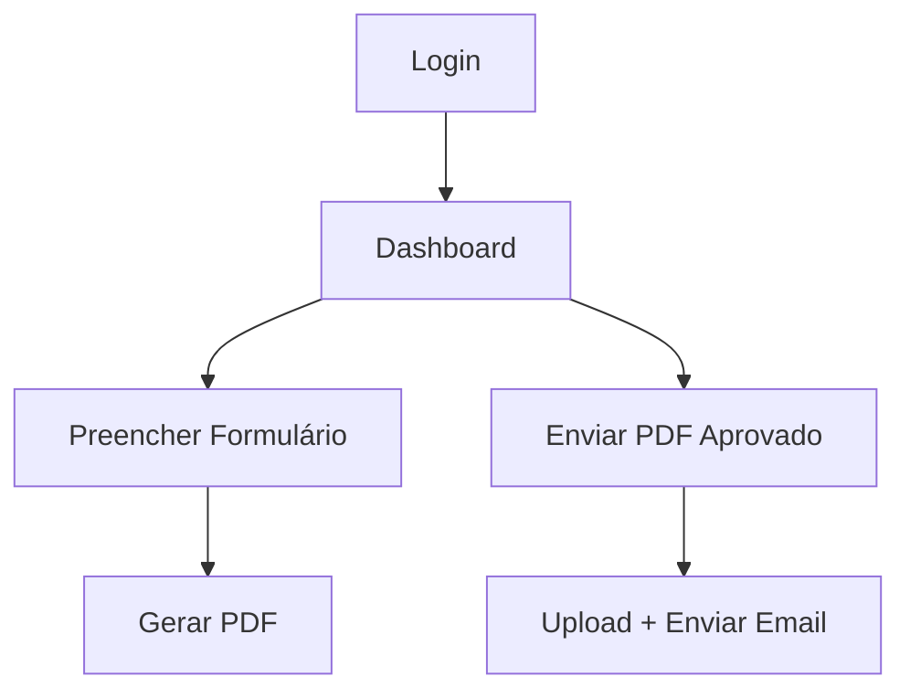

# Programa Especial de Saúde do Rio Doce

Sistema para elaboração e envio de planos de ação municipais.

## 🚀 Como Executar
1. Acesse: [https://pesriodoce.github.io/Teste/](https://pesriodoce.github.io/Teste/)
2. Faça login com:
   - **Código do município**: `MG310110` (exemplo)
   - **Senha**: `PESRD2025`

## 📂 Estrutura
```bash
index.html       # Tela de login/dashboard
formulario.html  # Preenchimento do plano
envio.html       # Envio do PDF aprovado
```

## 🔧 Configuração
Para desenvolvimento:
```bash
git clone https://github.com/pesriodoce/Teste.git
cd Teste
# Edite os arquivos conforme necessário
```

## 📌 Fluxo de Trabalho


## 📧 Contato
Em caso de problemas, contate:
- suporte.riodoce@saude.gov.br
